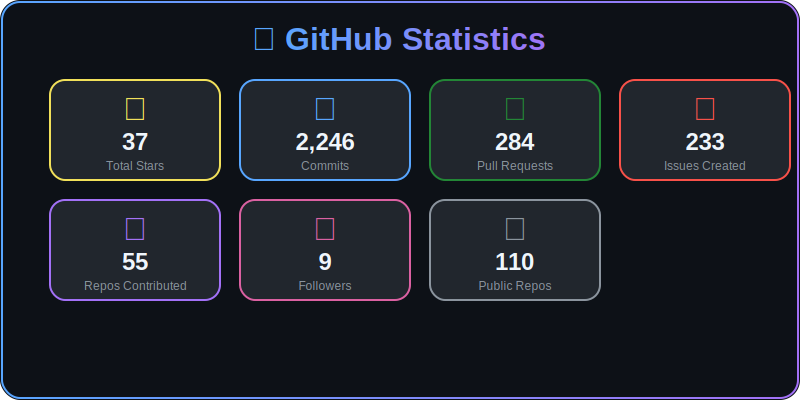
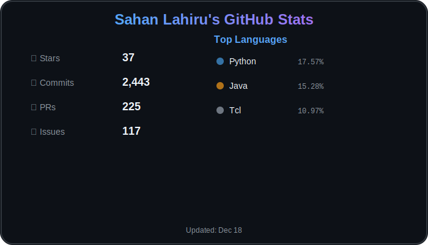

<h1 align="center">Hi 👋, I'm Sahan Lahiru</h1>

  
  

<h3 align="left">Connect with me:</h3>

## 📊 GitHub Stats Dashboard

### 👤 Profile Header

### 📈 GitHub Statistics  

### 💻 Most Used Languages

### 🎯 Quick Overview

---
*SVGs update automatically every 24 hours via GitHub Actions*
